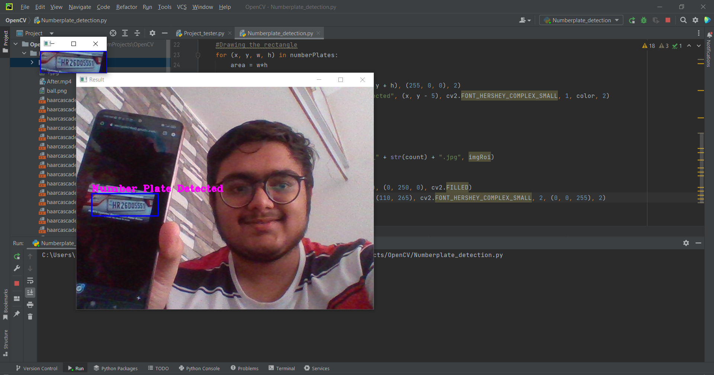
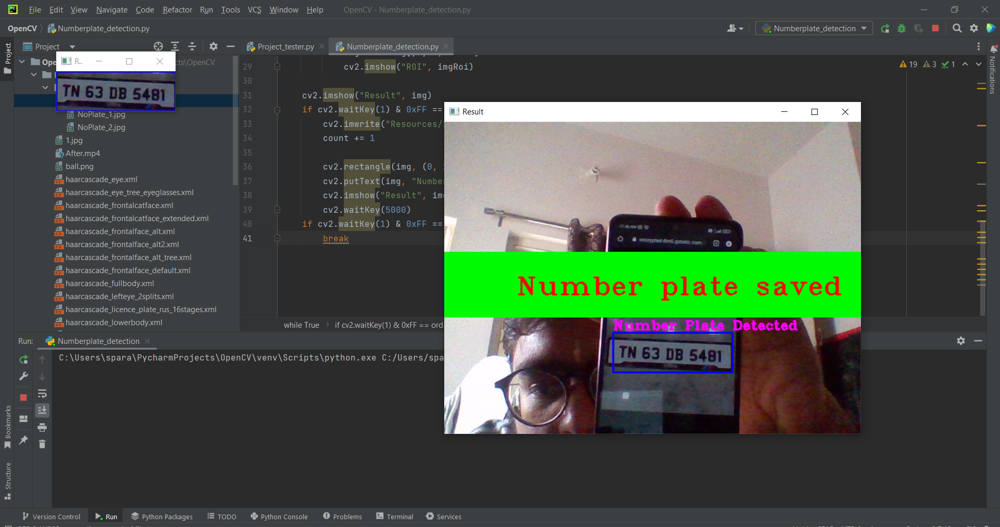

# Number Plate detector

Number Plate detector is a Python OpenCV based project used to detect Number Plates in controlled lighting conditions.  

It can be used by the traffic controller to save the number plates which violated the traffic rules and use it as a proof. Moreover, it quickly detects multiple numberplates at a time.

## Snapshots

Detection of the number Plates

Quickly Saving the number plate that is detected

